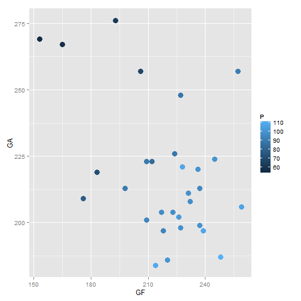

## Data

The official website of the National Hockey League, nhl.com, provides basic data for all 30 teams for each season. For the current, 2014-15 season, we take a subset of this data, including the following five variables:

1. Goals For
2. Goals Against
3. Power Play Percentage
4. Penalty Kill Percentage
5. Points

--- .class #id 

## Motivation

- A team's position in the playoffs is dependent on the number of points they accumulate throughout the season. 
- A team receives 2 points for a win.
- A team receives 1 point if they lose in overtime. 
- A team or a fan could use this tool to set goals for how many goals they want to score, how few goals to allow, etc., to get to a certain point total.
- A linear multivariate regression is ideal because it is quick, simple, and easily interpretable.

---

## Points vs. Goals For and Goals Against


```r
print(ggplot(nhl, aes(x=GF, y=GA, color=P)) + geom_point(size=4))
```

 

---

## Takeaways

- As we saw in the previous plot, a team is more likely to score more points when it scores more goals and has fewer goals scored against it.
- Interestingly, though, the coefficient of the Power Play Percentage variable is negative when using all four covariates:


```r
summary(lm(P ~ ., data=nhl))$coefficients
```

```
##                Estimate  Std. Error    t value     Pr(>|t|)
## (Intercept) 123.5757556 41.18531805  3.0004808 6.031208e-03
## GF            0.3920037  0.03887581 10.0834874 2.710383e-10
## GA           -0.3660469  0.04485023 -8.1615375 1.628911e-08
## PP           -0.6295131  0.32321637 -1.9476524 6.277032e-02
## PK           -0.3111669  0.41234607 -0.7546257 4.575238e-01
```

- This could be because, when holding the number of Goals a team scored constant, a higher power play percentage may mean that a team is too dependent on power plays to score. 
- Regardless, there are clearly some interesting insights that can be gained from this tool.


